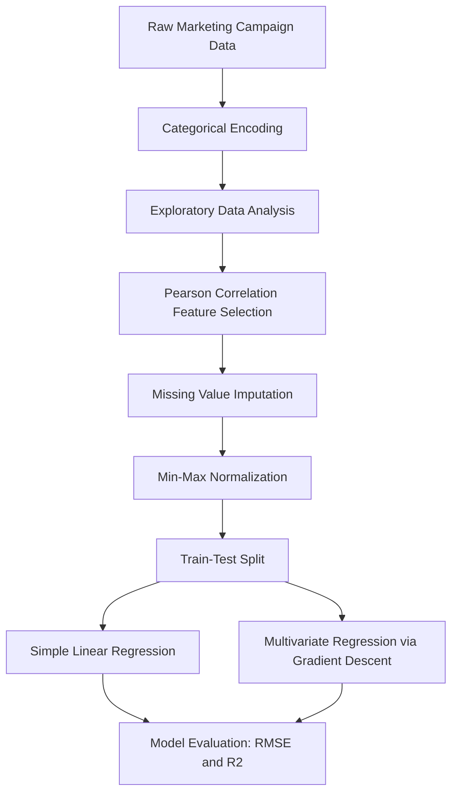

<div align="center">
  
</div>

---

# Customer Purchase Prediction via Linear Regression and Gradient Descent

The project demonstrates how classical regression techniques, implemented entirely from first principles with NumPy, can be used to model and predict customer purchase behavior from marketing campaign data, without relying on machine learning libraries such as scikit-learn.

<div align="left">

[](https://www.python.org/)
[](https://numpy.org/)
[](https://pandas.pydata.org/)
[](https://matplotlib.org/)
[](https://seaborn.pydata.org/)
[](#)
[](#)
[](https://opensource.org/licenses/MIT)

</div>

## Abstract

Understanding what drives customer purchasing behavior is a core problem in marketing analytics. This project builds a complete regression pipeline, from raw customer data to a trained predictive model, entirely from scratch using NumPy and Pandas. Starting from a marketing campaign dataset containing customer demographics, spending habits, and engagement metrics, the pipeline performs exploratory data analysis, correlation-based feature selection, missing-value imputation, and min-max normalization, before training and evaluating two regression models: a closed-form simple linear regression and a multivariate linear regression optimized with batch gradient descent. All core statistical and modeling components, including the Pearson correlation coefficient, train-test split, gradient descent optimizer, and evaluation metrics, are implemented manually to demonstrate a first-principles understanding of the underlying mathematics.

## Table of Contents

1. [Overview](#overview)
2. [Key Features](#key-features)
3. [Project Workflow](#project-workflow)
4. [Dataset](#dataset)
5. [Feature Selection and Preprocessing](#feature-selection-and-preprocessing)
6. [Modeling](#modeling)
7. [Evaluation and Results](#evaluation-and-results)
8. [Tools and Technologies](#tools-and-technologies)
9. [Project Structure](#project-structure)
10. [Installation](#installation)
11. [License](#license)
12. [Author](#author)
13. [Support](#support)

# Overview

This project predicts the number of purchases (`NumPurchases`) made by a customer using demographic, financial, and behavioral features from a marketing campaign dataset. Rather than relying on high-level machine learning libraries, every stage of the pipeline is implemented manually to expose the mechanics behind standard regression workflows.

Core capabilities include:

- Categorical Feature Encoding
- Exploratory Data Analysis (EDA)
- Custom Pearson Correlation-Based Feature Selection
- Missing Value Imputation and Min-Max Normalization
- Custom Train-Test Splitting
- Closed-Form Simple Linear Regression
- Multivariate Linear Regression via Batch Gradient Descent
- Custom RMSE and R² Evaluation Metrics

---

# Key Features

- From-scratch implementation of every statistical and modeling component, with no dependency on scikit-learn
- Manual Pearson correlation coefficient calculation used to drop uninformative features
- Missing-value imputation combined with min-max feature scaling
- Custom train-test split utility built on NumPy
- Analytical (closed-form) simple linear regression for single-feature prediction
- Batch gradient descent optimizer for multivariate linear regression, including feature standardization and cost-history tracking
- Custom RMSE and R² score functions for model evaluation

---

# Project Workflow



---

# Dataset

The project uses a marketing campaign dataset describing **2,240 customers** across **19 features**, covering:

| Category | Features |
|:---|:---|
| Demographics | `Year_Birth`, `Education`, `Marital_Status`, `Income`, `Kidhome`, `Teenhome` |
| Spending Habits | `MntCoffee`, `MntFruits`, `MntMeatProducts`, `MntFishProducts`, `MntSweetProducts`, `MntGoldProds` |
| Engagement | `Recency`, `NumWebVisitsMonth`, `Complain`, `UsedCampaignOffer`, `Dt_Customer` |
| Target Variable | `NumPurchases` |

Categorical columns (`Education`, `Marital_Status`) are mapped to ordinal numerical values before analysis.

---

# Feature Selection and Preprocessing

Feature relevance is assessed using a manually implemented **Pearson correlation coefficient** between every feature and the target variable (`NumPurchases`). Features with an absolute correlation below `0.1` are dropped as uninformative.

The remaining features are then:

1. Imputed for missing values using per-column mean imputation
2. Rescaled to the `[0, 1]` range using min-max normalization

The resulting cleaned dataset is used as the input for both regression models.

---

# Modeling

Two complementary regression approaches are implemented and compared:

### Simple Linear Regression

A single-feature model (`MntCoffee` → `NumPurchases`) solved analytically using the closed-form least-squares formula, without any iterative optimization.

### Multivariate Linear Regression with Gradient Descent

A multi-feature model (`Income`, `MntCoffee`, `MntFruits` → `NumPurchases`) trained using **batch gradient descent**:

- Features are standardized (zero mean, unit variance) prior to training
- An intercept term is added via a bias column
- Model parameters are updated iteratively to minimize the mean squared error
- The full cost history is tracked across iterations to monitor convergence

---

# Evaluation and Results

Both models are evaluated using two custom-built metrics:

- **RMSE (Root Mean Squared Error):** measures the average magnitude of prediction error
- **R² Score (Coefficient of Determination):** measures the proportion of variance in `NumPurchases` explained by the model

These metrics allow a direct comparison between the simplicity of the closed-form single-feature model and the added predictive power of the multivariate gradient descent model.

---

# Tools and Technologies

| Component | Purpose |
|:---|:---|
| NumPy | Numerical computation, custom regression and gradient descent implementation |
| Pandas | Data loading, cleaning, and manipulation |
| Matplotlib | Data visualization |
| Seaborn | Statistical visualization (pairplots, histograms, heatmaps) |

---

# Project Structure

```
Customer-Purchase-Prediction-via-Linear-Regression-and-Gradient-Descent/
│
├── notebooks/
│   └── customer_purchase_prediction.ipynb
│
├── data/
│   └── marketing_campaign.csv
│
└── README.md
```

---

# Installation

## Clone Repository

```bash
git clone https://github.com/ParmidaGh/Customer-Purchase-Prediction-via-Linear-Regression-and-Gradient-Descent.git
cd Customer-Purchase-Prediction-via-Linear-Regression-and-Gradient-Descent
```

## Create Environment

```bash
conda create -n purchase-prediction python=3.10
conda activate purchase-prediction
```

---

# License

This project is licensed under the MIT License.

---

## Author

**Parmida Ghamari**
M.Sc. Student, University of Tehran
Research Assistant @ Social Networks Lab

**Research Interests:** Machine Learning, Statistical Modeling and Regression Analysis, Feature Engineering, Data-Driven Marketing Analytics, Applied Data Science

📧 [Parmida.ghamari@gmail.com](mailto:Parmida.ghamari@gmail.com) | 💻 [github.com/ParmidaGh](https://github.com/ParmidaGh) | 💼 [www.linkedin.com/in/parmida-ghamari](https://www.linkedin.com/in/parmida-ghamari)

---

# Support

If you find this project useful, consider giving it a star ⭐

---

<p align="center">Built using NumPy and Pandas</p>
